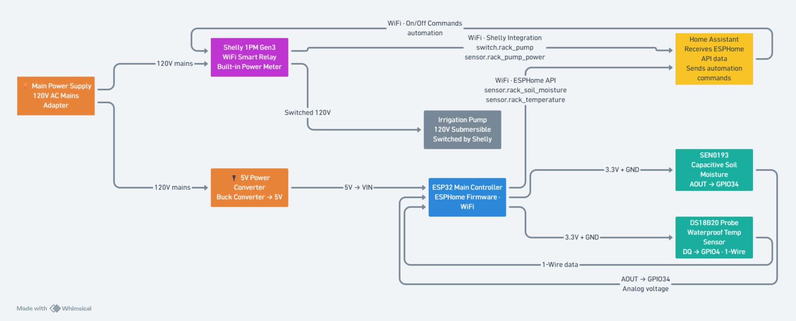

# Integration and Control Design

---

## Block diagram

Created via Whimsical.com

**Plain description:** Both sensors wire into a single ESP32 board. The ESP32 runs ESPHome firmware, which translates the raw sensor signals into two readable values and sends them to Home Assistant over WiFi. Home Assistant runs the control logic and sends on/off commands to the Shelly relay. The Shelly relay switches the pump.

**On the integration constraint:** the SEN0193 moisture sensor is the non-native component required by the brief. It is an analog part with no radio. The DS18B20 temperature probe is also non-native and rides the same ESP32. I chose that over a native Zigbee temperature sensor because no mainstream Matter or Zigbee temperature sensor is sealed for burial at substrate level, and the ESP32 already exists in the design, so the probe adds no second radio, no second pairing step, and no second thing to lose on the network.

## How each device joins Home Assistant

### ESP32 bridge (carries both sensors)

The ESP32 runs ESPHome. When it powers on it connects to WiFi and announces itself to Home Assistant automatically. No manual pairing steps; HA sees it as a device with two sensors.

Entities it exposes:
- `sensor.rack_soil_moisture` - moisture reading as a 0-100% value
- `sensor.rack_temperature` - temperature in degrees Celsius

Both appear in HA like any off-the-shelf smart sensor and can be used in automations, history graphs, and dashboards with no extra setup.

### Shelly 1PM Gen3 (pump relay)

Plug it in and open the Shelly app once to connect it to your WiFi. After that, Home Assistant discovers it automatically through the built-in Shelly integration. No cloud account required; everything runs locally.

Entities it exposes:
- `switch.rack_pump` - turns the pump on or off
- `sensor.rack_pump_power` - live watt reading; used to confirm the pump is actually running

---

## Bridging design: SEN0193 moisture sensor

### Why it needs bridging

The SEN0193 is not a smart device. It has no WiFi or Zigbee radio. It outputs a plain analog voltage of 1.2V to 2.5V, where higher means drier. Home Assistant cannot read that directly.

### Hardware

Wire the SEN0193 to the ESP32 as follows:

| SEN0193 pin | ESP32 pin |
|---|---|
| VCC | 3.3V |
| GND | GND |
| AOUT (signal) | GPIO34 |

### Firmware config

See `/ha-config/esphome-bridge.yaml`.

The key part is the `adc` sensor block. ESPHome samples GPIO34 once every 60 seconds and applies a two-point calibration map converting the voltage into a 0-100% scale. The result is published to HA as `sensor.rack_soil_moisture`. 
A 60-second interval is deliberate, as soil moisture changes slowly, and a slower sample rate reduces WiFi traffic and log noise over a 21-day run.

---

## Control logic

### The decision

The pump runs only when both of these are true:
1. Soil moisture is below the dry threshold
2. Temperature is present and within a plausible range

Moisture alone does not trigger the pump. Temperature alone does not trigger it either. Moisture decides whether to water at all; temperature decides how much.

### How temperature modifies the decision

Temperature sets how long the pump runs per cycle.

| Soil moisture | Temperature | Pump action |
| --- | --- | --- |
| Above 40% | Any | Off |
| Below 40% | Below 15C | Short cycle, 30 seconds |
| Below 40% | 15C to 25C | Medium cycle, 60 seconds |
| Below 40% | Above 25C | Long cycle, 90 seconds |

If either reading is missing or outside a plausible range (moisture outside 0-100%, temperature outside -10C to 50C), the pump stays off and a fault alert is raised. See the failure table below.

### Hysteresis

The pump does not turn on the instant moisture drops below 40%. It turns on at 40% and does not turn off until moisture recovers to 50%. This 10-point gap prevents the pump from rapidly switching on and off around the threshold.

### Anti-short-cycling

Once the pump runs a cycle, it cannot run again for at least 10 minutes. This protects the pump motor from wear caused by rapid restarts and gives the moisture reading time to stabilize after watering.

---

## Failure modes and safe states

The safe state in every case is **pump off**. Watering on bad data risks drowning the root zone; not watering for one cycle is recoverable.

| Failure | How HA detects it | Safe state | Alert |
| --- | --- | --- | --- |
| Moisture sensor offline | `sensor.rack_soil_moisture` unavailable for 5+ min | Pump stays off | Yes |
| Temperature sensor offline | `sensor.rack_temperature` unavailable for 5+ min | Pump stays off | Yes |
| Moisture reading implausible | Value above 100% or below 0% | Treated as offline, pump stays off | Yes |
| Temperature reading implausible | Value above 50C or below -10C | Treated as offline, pump stays off | Yes |
| Pump commanded on, no power draw | Shelly power sensor reads under 5W five seconds after switch-on | Pump switched back off | Yes |
| Pump stuck on | Shelly power sensor reads above 5W while switch is off | Cannot be corrected in software; relay or pump has failed | Yes, high priority |
| HA restart | Startup automation runs on `homeassistant.start` | Pump forced off, lockout timer restarts | No |
| WiFi loss on ESP32 | Entities go unavailable | Pump stays off, recovers on reconnect | Yes after 10 min |
| Shelly loses WiFi | `switch.rack_pump` unavailable | HA cannot command the pump; its last physical state persists | Yes |

Two of these rows depend on the Shelly's built-in watt meter. Most smart relays do not have one. Without it, "pump on" would mean only that a command was sent, and a pump that failed silently would go unnoticed for the full 21 days.

The stuck-on row is the one genuine hole. If the relay itself welds shut, no amount of software can open it; the alert exists so a human intervenes. A hardware answer would be a second relay in series or a normally-closed solenoid on the water line, which is outside the scope of this slice.

---
## Where I disagree with the architecture, and why I built it their way anyway

Putting the correlation logic in Home Assistant means an irrigation decision depends on WiFi staying up, on the HA host staying healthy, and on a general-purpose home automation server not being mid-upgrade. The same two readings and the same decision could run entirely on the ESP32, where the sensors physically are, and fail safe locally with no network at all. For a single unattended rack over 21 days, that would be more robust.

## Bench-test order

Each step must pass before the next.

1. Flash ESPHome to the ESP32. Confirm it appears in HA with two sensor entities reporting real values. Record the actual entity IDs and correct the automation if they differ from the ones above.

2. Calibrate the moisture sensor. Record the voltage in open air and fully submerged, and put those two values into the `calibrate_linear` block. Confirm air reads near 0% and water near 100%.

3. Check the DS18B20 against a known thermometer. Confirm agreement within 1 degree.

4. Substitute `input_number` helpers for the two sensor entities in the automation. Set moisture to 30 and temperature to 28, and confirm the automation fires and the pump runs for 90 seconds. Helpers are used here rather than Developer Tools state overrides, because an ESPHome-backed sensor overwrites a manual state on its next update.

5. Repeat step 4 across the three temperature bands and confirm each runtime matches the table.

6. Set moisture to 60 and confirm no cycle starts. Set it back below 40 within the lockout window and confirm no cycle starts.

7. Set a sensor to `unavailable`. Confirm the alert fires after five minutes and the pump stays off.

8. Command the pump on manually and confirm the Shelly reports power draw within five seconds.

9. Restart Home Assistant. Confirm the startup automation forces the pump off.

10. Point the automation back at the real sensors and run unattended for 24 hours. Review history for dropouts, unexpected cycles, or moisture failing to rise after a cycle.
